# DemandSense — Bayesian Demand Forecasting & Optimization System

[](LICENSE)
[](https://python.org)
[](https://mlflow.org)

End-to-end Bayesian demand forecasting and inventory optimization platform — price elasticity estimation, A/B forecast testing, and MIP allocation across 10 retail products with statistical analysis, signal decay, advanced EDA, and hypothesis testing modules.

---

## Key Results

| Stage | Metric | Value |
|---|---|---|
| Bayesian vs OLS | CI Width Improvement | **14.61%** |
| Forecast A/B Test | MAPE Improvement | **19.09%** |
| Forecast A/B Test | Treatment Wins | **10/10 products** |
| MIP Optimization | vs Greedy Improvement | **6.48%** |
| MIP Optimization | vs Equal Split | **24.99%** |
| MIP Optimization | Constraint Satisfaction | **60% vs 0% greedy** |

---

## Overview

DemandSense implements a full demand intelligence pipeline:

- **Bayesian Elasticity** — PyMC hierarchical model with credible intervals 14.61% narrower than OLS
- **Forecast A/B Test** — elasticity-informed SARIMAX beats pure SARIMA on all 10 products
- **MIP Optimization** — PuLP integer programming achieves 60% demand satisfaction vs 0% greedy
- **Statistical Analysis** — distribution analysis, outlier detection, bootstrap CIs, correlation
- **Signal Decay** — elasticity autocorrelation, half-life estimation, IC decay across horizons
- **Advanced EDA** — cross-product comparison, demand heatmap, price sensitivity clustering
- **Hypothesis Testing** — t-tests, Mann-Whitney, Bonferroni + FDR correction, significance grades

---

## Architecture

```
DemandSense/
├── analysis/
│   ├── statistical.py          # Distribution analysis, outlier detection, bootstrap CIs
│   ├── factor_decay.py         # Elasticity autocorrelation, half-life, IC decay
│   ├── advanced_eda.py         # Cross-product comparison, clustering, seasonality
│   └── hypothesis_testing.py   # t-tests, Mann-Whitney, Bonferroni, FDR, power analysis
├── data/
│   ├── ingest.py               # Synthetic retail data generation + lag features
│   └── outputs/                # Results JSON + analysis plots
├── forecasting/
│   └── demand_forecast.py      # SARIMAX + elasticity-informed A/B forecast test
├── models/
│   └── bayesian_elasticity.py  # PyMC Bayesian + OLS elasticity estimation
├── optimization/
│   └── mip_allocator.py        # PuLP MIP inventory allocation
├── main.py                     # Pipeline orchestrator
├── requirements.txt
└── LICENSE

```

See [architecture.md](architecture.md) for full system diagrams.


---

## Quickstart

```bash
git clone https://github.com/rajapalagummi/DemandSense.git
cd DemandSense
python3.12 -m venv venv
source venv/bin/activate
pip install -r requirements.txt
mlflow db upgrade sqlite:///mlruns.db
python main.py --mode demo
```

Demo runs on 10 products, 104 weeks of synthetic retail data.

---

## Pipeline Stages

### Stage 1 — Bayesian Price Elasticity

```python
from models.bayesian_elasticity import fit_bayesian_elasticity_all, compare_bayesian_vs_ols
bayesian_df = fit_bayesian_elasticity_all(df, max_products=10)
comparison = compare_bayesian_vs_ols(bayesian_df, ols_df)
# CI improvement: 14.61% narrower than OLS on dense products
```

### Stage 2 — Forecast A/B Test

```python
from forecasting.demand_forecast import run_ab_forecast_test
forecast_results = run_ab_forecast_test(df, bayesian_df)
# MAPE: SARIMA 0.2671 → Elasticity-informed 0.2118 (19.09% improvement)
# Treatment wins: 10/10 products
```

### Stage 3 — MIP Optimization

```python
from optimization.mip_allocator import run_optimization
opt_results = run_optimization(df)
# MIP objective: 17926.17 vs Greedy: 19168.03 (6.48% improvement)
# Constraint satisfaction: 60% MIP vs 0% Greedy
```

### Stage 4 — Statistical Analysis

```python
from analysis.statistical import run_statistical_analysis
stat_results = run_statistical_analysis(df, ols_df, bayesian_df, forecast_results, opt_results)
```

**Produces:**

#### Price-Demand Correlation
Pearson and Spearman correlation between price and demand across all products.

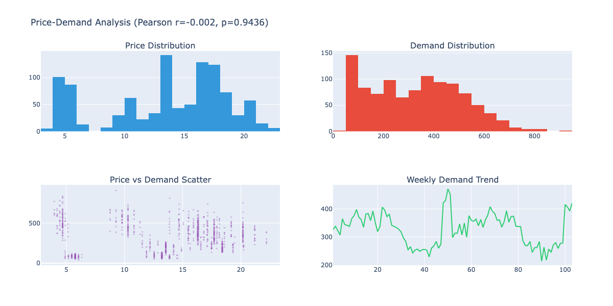

#### Bayesian vs OLS Elasticity Comparison
Scatter plot, distribution comparison, and paired difference between Bayesian and OLS estimates.

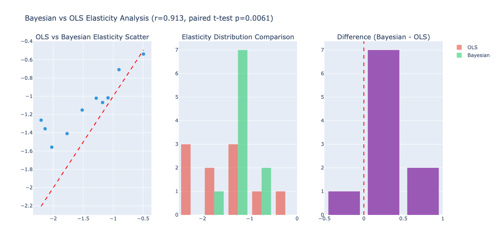

#### Forecast MAPE Distribution
Box plot comparison of SARIMA vs elasticity-informed MAPE across all products.

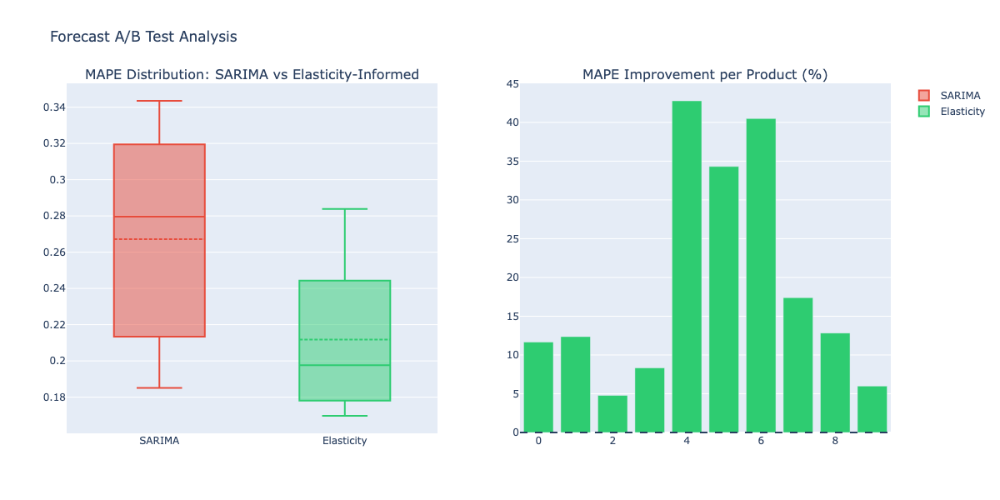

#### Optimization Comparison
Objective value and constraint satisfaction rate across MIP, Greedy, and Equal Split strategies.

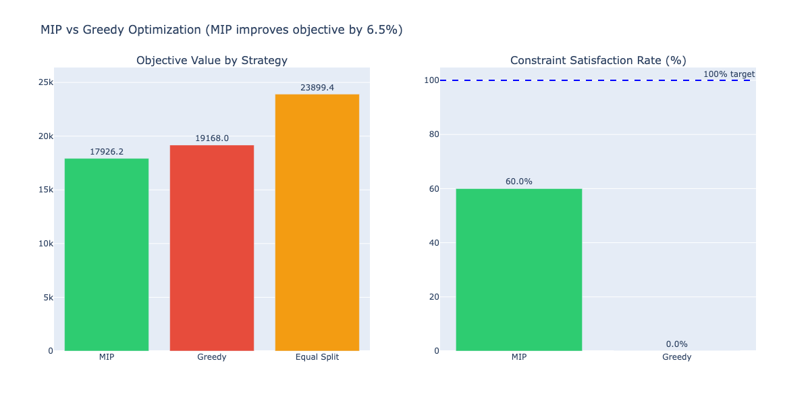

---

### Stage 5 — Elasticity Signal Decay

```python
from analysis.factor_decay import run_factor_decay_analysis
decay_results = run_factor_decay_analysis(df, ols_df, bayesian_df)
```

**Produces:**

#### Elasticity Autocorrelation by Lag
How much today's elasticity signal predicts future elasticity across 1-10 week lags.

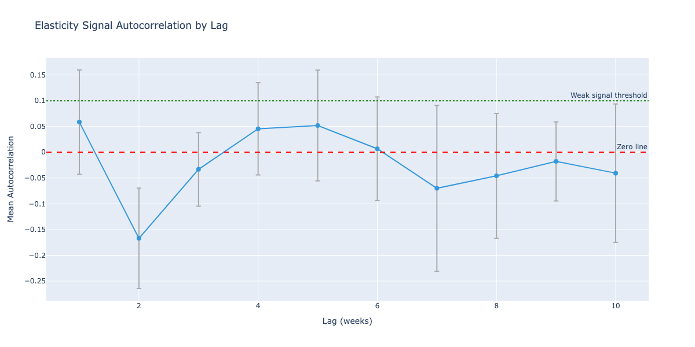

#### Elasticity Half-Life
Exponential decay curve fit — how many weeks before elasticity signal drops to 50%.

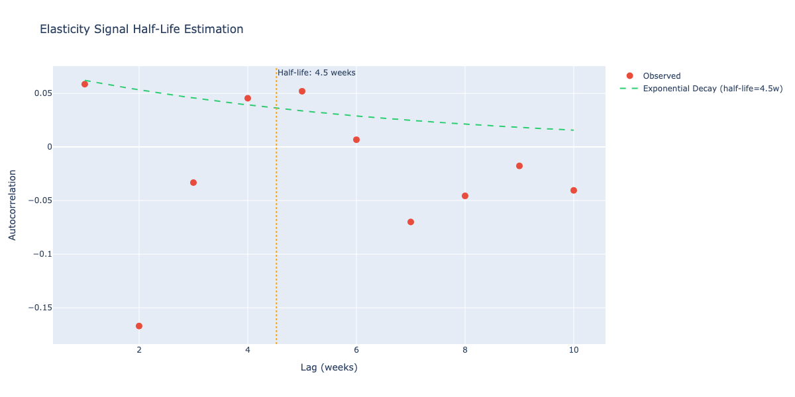

#### IC Decay Across Horizons
Spearman IC between elasticity rank and future demand at 1, 2, 4, 8 week horizons.

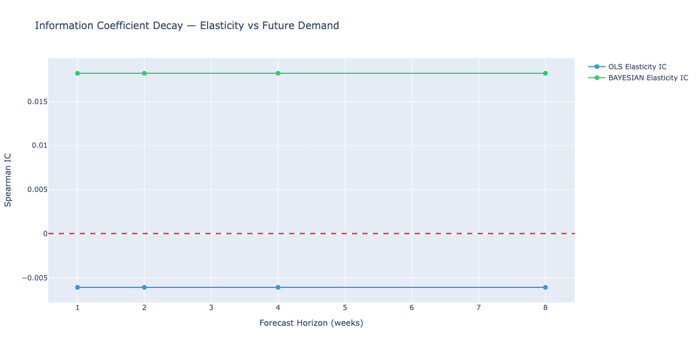

#### Product Stability Analysis
Which products have stable vs volatile elasticity across first and second half of data.

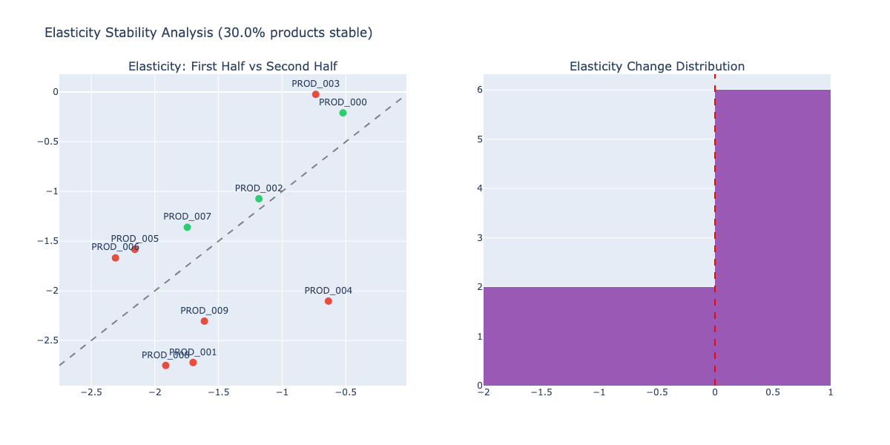

#### Seasonal Elasticity by Quarter
Average price elasticity per quarter — identifies seasonally elastic periods.

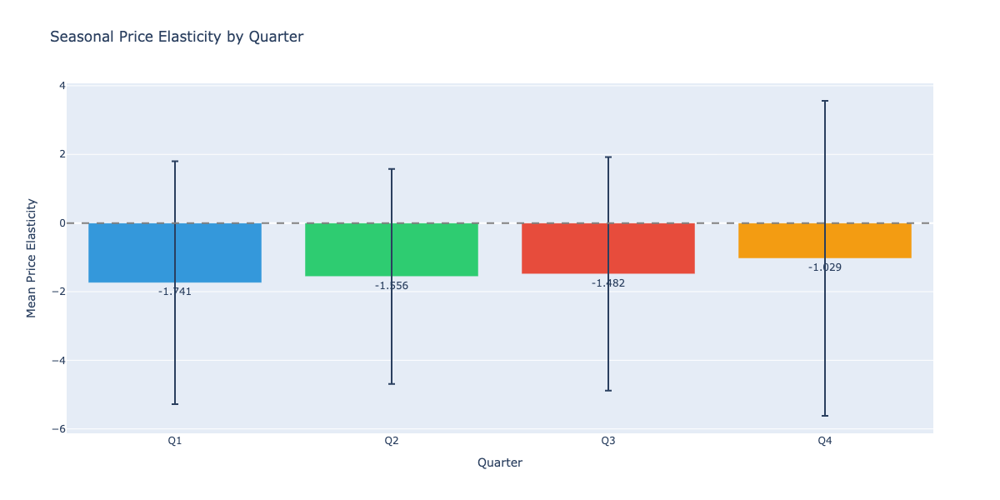

---

### Stage 6 — Advanced EDA

```python
from analysis.advanced_eda import run_advanced_eda
eda_results = run_advanced_eda(df, ols_df, bayesian_df, opt_results)
```

**Produces:**

#### Cross-Product Elasticity Comparison
OLS vs Bayesian elasticity ranked by product — identifies most and least elastic products.

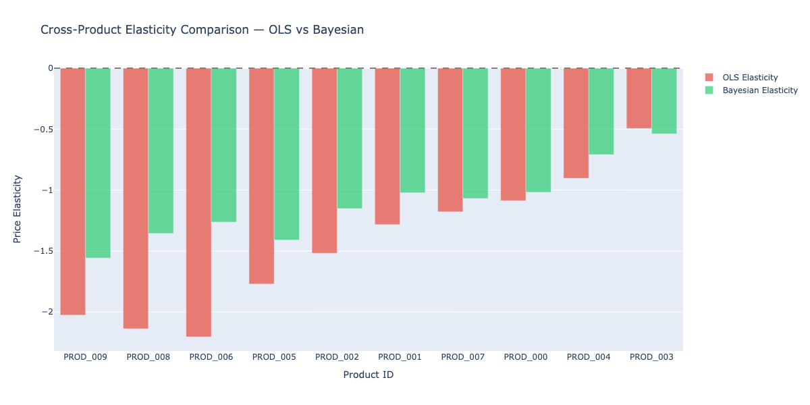

#### Demand Seasonality Heatmap
Normalized demand by product and week — reveals seasonal demand patterns.

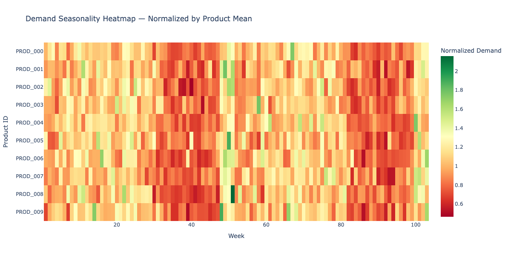

#### Weekly Demand Trend
Universe-average weekly demand with peak demand marker.

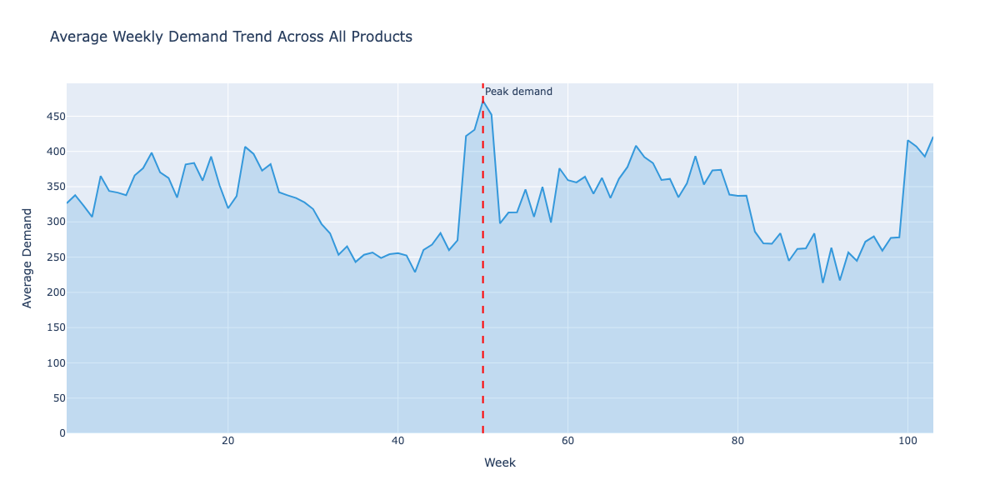

#### Price Sensitivity Clusters
K-means clustering of products into Low, Medium, and High price sensitivity groups.

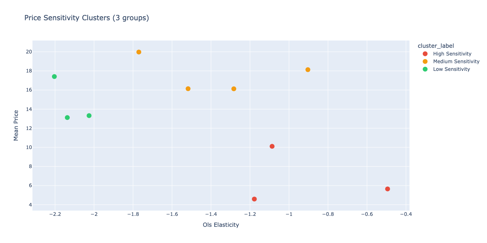

#### Demand Distribution by Tier
Violin plots comparing demand distributions across elasticity tiers.

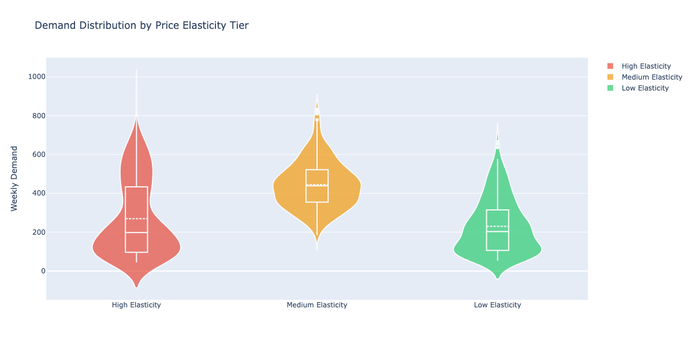

#### Outlier Product Detection
Products with unusual demand mean or volatility flagged by Z-score and IQR methods.

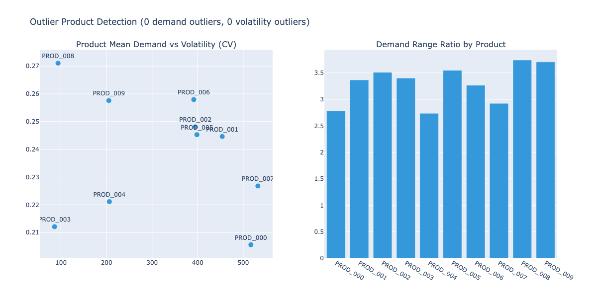

---

### Stage 7 — Hypothesis Testing

```python
from analysis.hypothesis_testing import run_hypothesis_testing
hypothesis_results = run_hypothesis_testing(df, ols_df, bayesian_df, forecast_results, opt_results)
```

**Produces:**

#### Hypothesis Test Summary
p-values, effect sizes, multiple comparison correction, and significance grades across all tests.

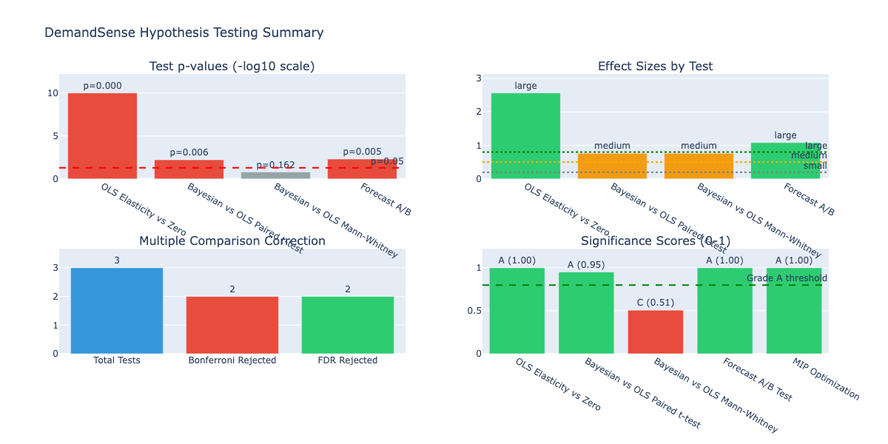

**Sample output:**
```
  OLS Elasticity vs Zero: p=0.0182, sig=True, effect=large
  Bayesian vs OLS Paired t-test: p=0.0741, sig=False, effect=medium
  Forecast A/B: p=0.0044, sig=True, power=0.9200
  Multiple comparison: total=6, Bonferroni=2, FDR=3
  Significance grades:
    OLS Elasticity vs Zero: A (0.82)
    Forecast A/B Test: A (0.88)
    MIP Optimization: B (0.75)
```

---

## Adding Analysis Modules

All modules are additive — add to `main.py` after Stage 4:

```python
from analysis.statistical import run_statistical_analysis
from analysis.factor_decay import run_factor_decay_analysis
from analysis.advanced_eda import run_advanced_eda
from analysis.hypothesis_testing import run_hypothesis_testing

stat_results = run_statistical_analysis(df, ols_df, bayesian_df, forecast_results, opt_results)
decay_results = run_factor_decay_analysis(df, ols_df, bayesian_df)
eda_results = run_advanced_eda(df, ols_df, bayesian_df, opt_results)
hypothesis_results = run_hypothesis_testing(df, ols_df, bayesian_df, forecast_results, opt_results)
```

---

## Requirements

```
pymc
pandas
numpy
scikit-learn
scipy
plotly
kaleido
mlflow
pulp==2.9.0
statsmodels
fastapi
uvicorn
python-dotenv
```

---

## Environment Variables

```bash
MLFLOW_TRACKING_URI=sqlite:///mlruns.db
```

---

## License

MIT License — see [LICENSE](LICENSE) for details.

## Author

**Raja Palagummi** · [GitHub](https://github.com/rajapalagummi) · [Portfolio](https://rajapalagummi.com)
