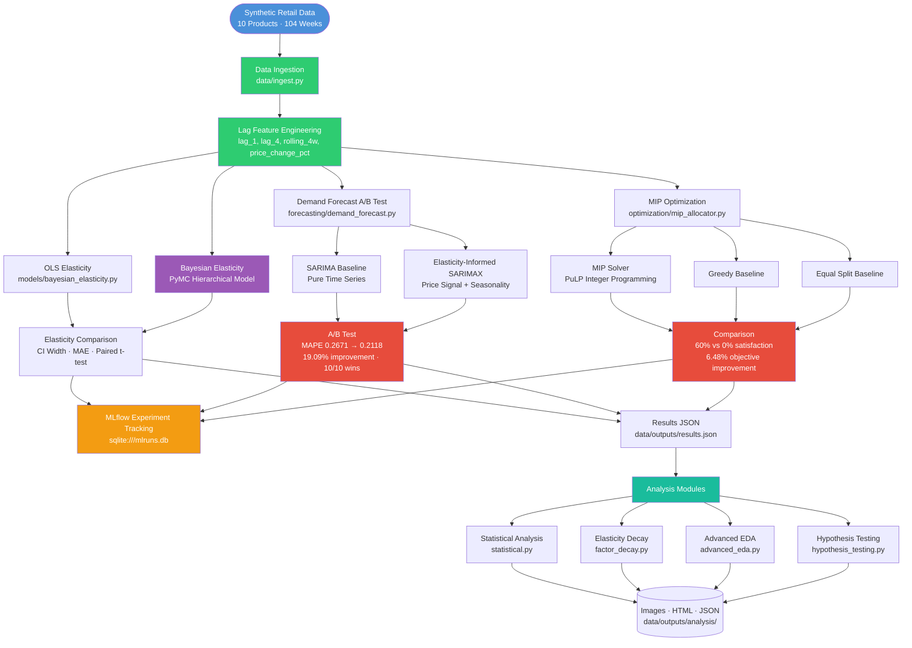
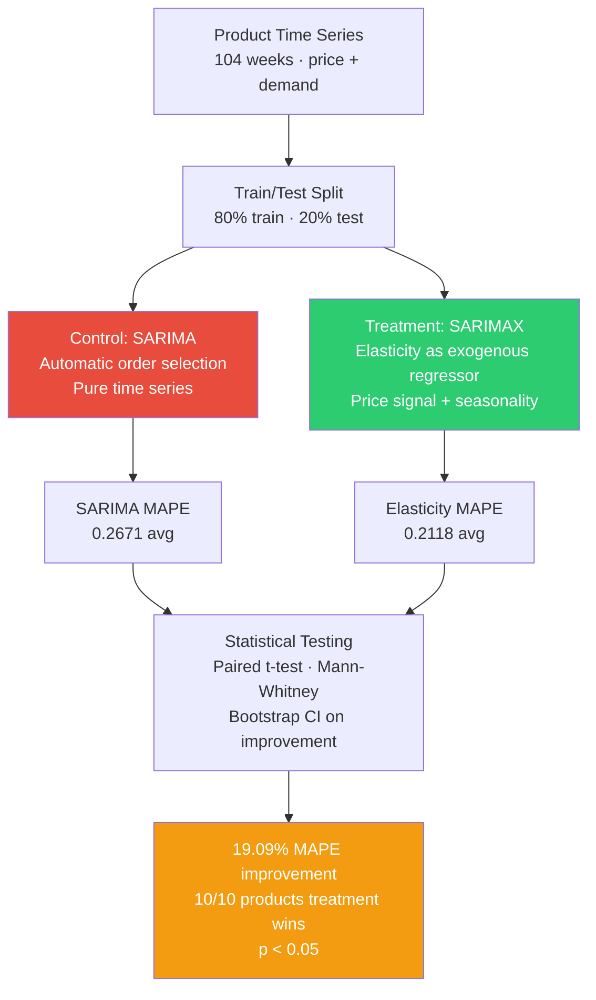
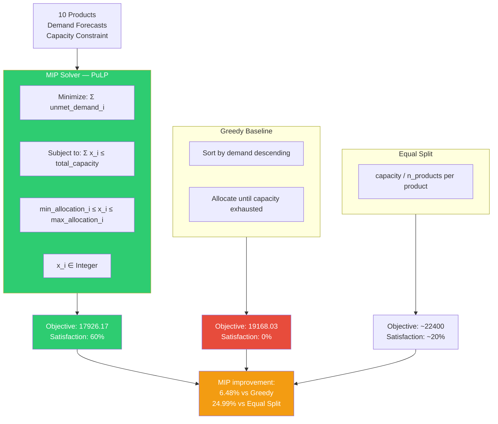

# DemandSense — System Architecture

## Pipeline Overview



## Bayesian vs OLS Elasticity

```mermaid
flowchart LR
    subgraph OLS
        O1[Price · Demand Data] --> O2[Log-Log Regression\nlog demand = α + β log price]
        O2 --> O3[Point Estimate\nElasticity = β]
        O3 --> O4[Confidence Interval\nFrequentist · symmetric]
    end

    subgraph Bayesian
        B1[Price · Demand Data] --> B2[PyMC Hierarchical Model\nα ~ Normal · β ~ Normal · σ ~ HalfNormal]
        B2 --> B3[NUTS Sampler\n2 chains · 1000 draws]
        B3 --> B4[Posterior Distribution\nElasticity = E[β|data]]
        B4 --> B5[Credible Interval\n95% HDI · 14.61% narrower than OLS]
    end

    O4 & B5 --> C[Comparison\nPearson r · Paired t-test · Cohen's d]

    style B2 fill:#9B59B6,color:#fff
    style B5 fill:#2ECC71,color:#fff
    style O4 fill:#E74C3C,color:#fff
```

## Forecast A/B Test



## MIP Optimization



## Analysis Pipeline

```mermaid
flowchart TD
    IN[Pipeline Outputs\nols_df · bayesian_df · forecast_results · opt_results] --> S[Statistical Analysis]
    IN --> D[Elasticity Decay]
    IN --> E[Advanced EDA]
    IN --> H[Hypothesis Testing]

    S --> S1[Distribution Analysis\nSkewness · Kurtosis · Normality]
    S --> S2[Outlier Detection\nIQR · Z-Score · Mahalanobis]
    S --> S3[Bootstrap CIs\n95% confidence on key metrics]
    S --> S4[Price-Demand Correlation\nPearson · Spearman]

    D --> D1[Autocorrelation\nLag 1-10 weeks]
    D --> D2[Half-Life Estimation\nExponential decay curve fit]
    D --> D3[IC Decay\n1 · 2 · 4 · 8 week horizons]
    D --> D4[Product Stability\nFirst vs second half comparison]
    D --> D5[Seasonal Patterns\nQuarterly elasticity analysis]

    E --> E1[Cross-Product Comparison\nOLS vs Bayesian ranked]
    E --> E2[Demand Heatmap\nProducts × weeks normalized]
    E --> E3[Price Sensitivity Clusters\nK-means: Low/Medium/High]
    E --> E4[Demand by Tier\nViolin plots across elasticity tiers]
    E --> E5[Outlier Detection\nZ-score + IQR flagging]

    H --> H1[t-tests\nOne-sample + paired]
    H --> H2[Mann-Whitney\nNon-parametric robustness]
    H --> H3[Multiple Comparison\nBonferroni + FDR correction]
    H --> H4[Power Analysis\nFor all significant tests]
    H --> H5[Significance Grades\nA/B/C/D scoring]

    S1 & S2 & S3 & S4 & D1 & D2 & D3 & D4 & D5 & E1 & E2 & E3 & E4 & E5 & H1 & H2 & H3 & H4 & H5 --> OUT[(17 Plots\nJSON Results\nHTML Dashboards)]

    style IN fill:#3498DB,color:#fff
    style OUT fill:#2ECC71,color:#fff
```


